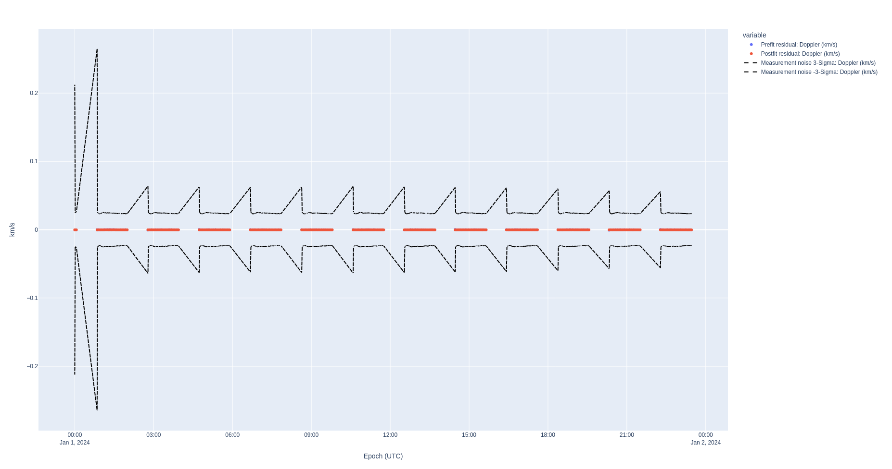

# Nyx: Comprehensive Spaceflight Dynamics

[**Empowering flight dynamics engineers with open-source software**][website]

Nyx is revolutionizing the field of flight dynamics engineering as a powerful, open-source tool for mission design and orbit determination. From trajectory optimization to orbit estimation, Nyx is built for speed, automation, and scalability.

**Nyx has proven mission-critical reliability, already contributing to the success of three lunar missions.**

[![Nyx Space Badget][nyxspace-image]][website]
[![Contact Form][contact-form-image]][contact]

[![nyx-space on crates.io][cratesio-image]][cratesio]
[![nyx-space on docs.rs][docsrs-image]][docsrs]

# Showcase

[The website has the latest use cases][showcase]

## GEO Low Thrust Orbit Raising & StationKeeping

[Click for description](https://nyxspace.com/nyxspace/showcase/03_geo_analysis/?utm_source=readme-showcase)

## James Webb Space Telescope Monte Carlo Simulation

[Click for description](https://nyxspace.com/nyxspace/showcase/02_jwst_covar_monte_carlo/?utm_source=readme-showcase)

## Orbit Determination of the Lunar Reconnaissance Orbiter

[Click for description](https://nyxspace.com/nyxspace/showcase/04_lro_od/?utm_source=readme-showcase)

# Documentation

The documentation is currently being updated. If you have specific use cases you would like to see documented, please [open a Github issue](https://github.com/nyx-space/nyx/issues/new?assignees=&labels=Documentation&projects=&template=documentation.md&title=) or [use the contact form][contact]

## Quick start

### Rust

To install Nyx, follow these steps:
1. Clone the repository: `git clone https://github.com/nyx-space/nyx.git`
2. Navigate to the directory: `cd nyx`
3. Run any of the [examples](./examples/), e.g. `RUST_LOG=info cargo run --example 01_orbit_prop --release`

#### Compilation

Nyx uses `lld`, the LLVM linker, for faster compilation times. You may need to manually install `lld` depending on your distribution. On Ubuntu, this command is `sudo apt install clang lld`.

### Python

For Python projects, get started by installing the library via `pip`: `pip install nyx_space`.

**Important:** The Python package has been temporarily disabled. Refer to <https://github.com/nyx-space/nyx/issues/311> for details.

# License

Nyx is provided under the [AGPLv3 License](./LICENSE). By using this software, you assume responsibility for adhering to the license. Refer to [the pricing page](https://nyxspace.com/pricing/?utm_source=readme-price) for an FAQ on the AGPLv3 license. Notably, any software that incorporates, links to, or depends on Nyx must also be released under the AGPLv3 license, even if you distribute an unmodified version of Nyx.

# Versioning

Nyx mostly adheres to SemVer. New patch versions should be rare. Updated dependencies trigger a new minor version. _However_ new fields in structures and new behavior may also be added with minor releases, but the public facing initializers and functions should not significantly change (but may still change).

Major releases are for dramatic changes.

[cratesio-image]: https://img.shields.io/crates/v/nyx-space.svg
[cratesio]: https://crates.io/crates/nyx-space
[docsrs-image]: https://docs.rs/nyx-space/badge.svg
[docsrs]: https://rustdoc.nyxspace.com/?utm_source=readme
[contact-form-image]: https://img.shields.io/badge/Nyx_Space-Contact-orange
[contact]: https://7ug5imdtt8v.typeform.com/to/neFvVW3p
[nyxspace-image]: https://img.shields.io/badge/Nyx_Space-Website-orange
[website]: https://nyxspace.com/?utm_source=readme
[showcase]: https://nyxspace.com/nyxspace/showcase/?utm_source=readme

# Author information

> Chris Rabotin is a GNC and flight dynamics engineer with a heavy background in software.

I currently work for Rocket Lab USA as the lead flight dynamics engineer on both Blue Ghost lunar lander missions. -- Find me on [LinkedIn](https://www.linkedin.com/in/chrisrabotin/).
